# RFrame Software Architecture & Design

## Overview

RFrame is a robotics framework built for FTC (FIRST Tech Challenge) that provides abstractions for drivetrain control, odometry, autonomous actions, and subsystem management. It separates hardware-agnostic logic from FTC-specific implementations, enabling reuse across robot designs and even simulation.

---

## High-Level System Architecture

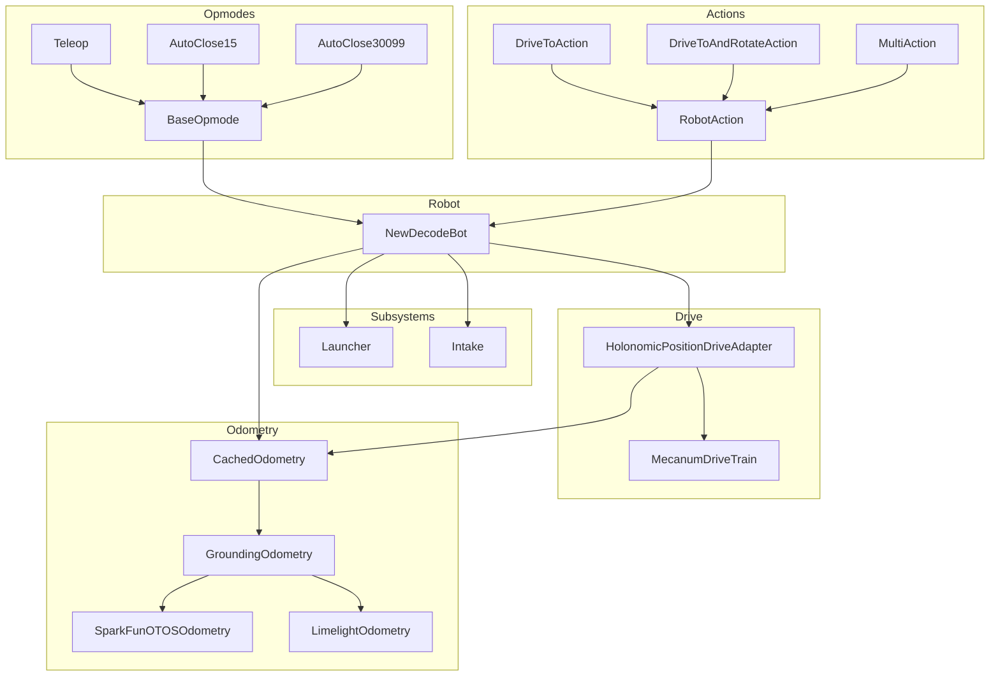

---

## Core Type Hierarchy

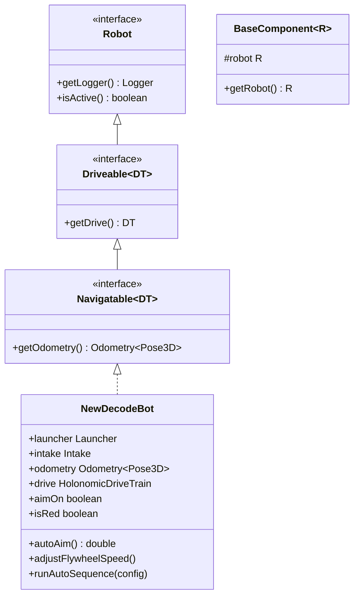

---

## Drive System

The drive system uses a layered adapter pattern. Raw motor commands are abstracted behind `DriveTrain`, and field-relative translation is added by wrapping the drivetrain with an odometry-aware adapter.

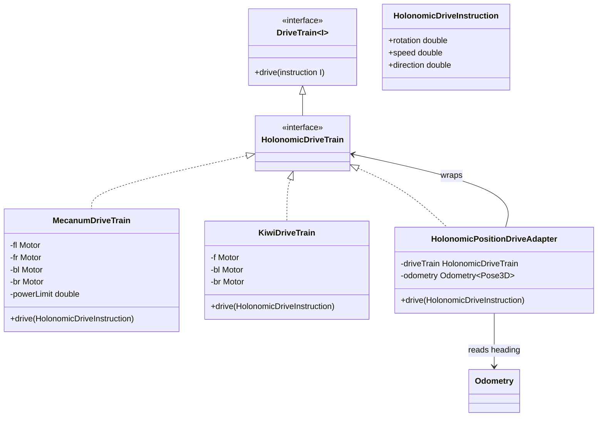

### Drive Instruction Flow

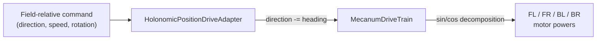

---

## Odometry Stack

Odometry uses sensor fusion. The SparkFun OTOS provides continuous dead-reckoning, while the Limelight camera provides absolute position fixes via AprilTags. `GroundingOdometry` blends them, and `CachedOdometry` reduces polling overhead.

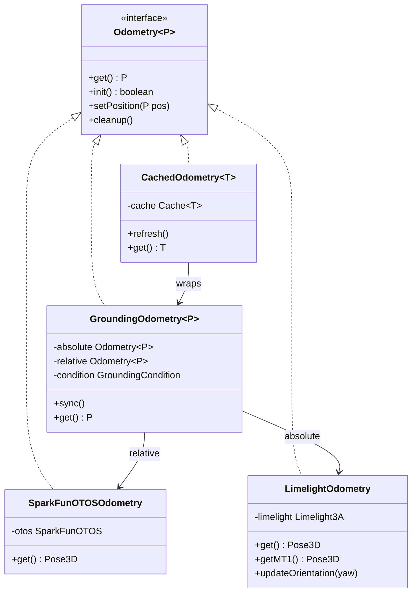

### Sensor Fusion Data Flow

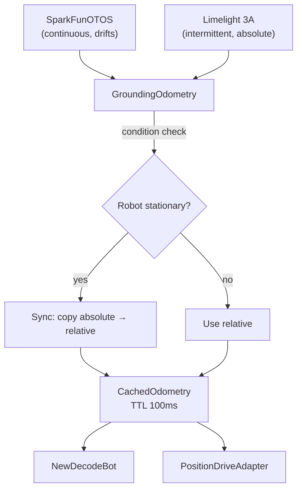

---

## Coordinate System

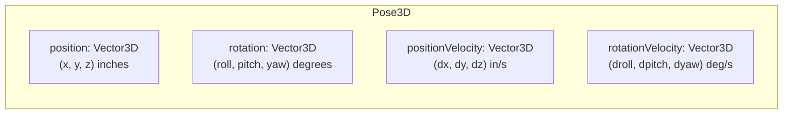

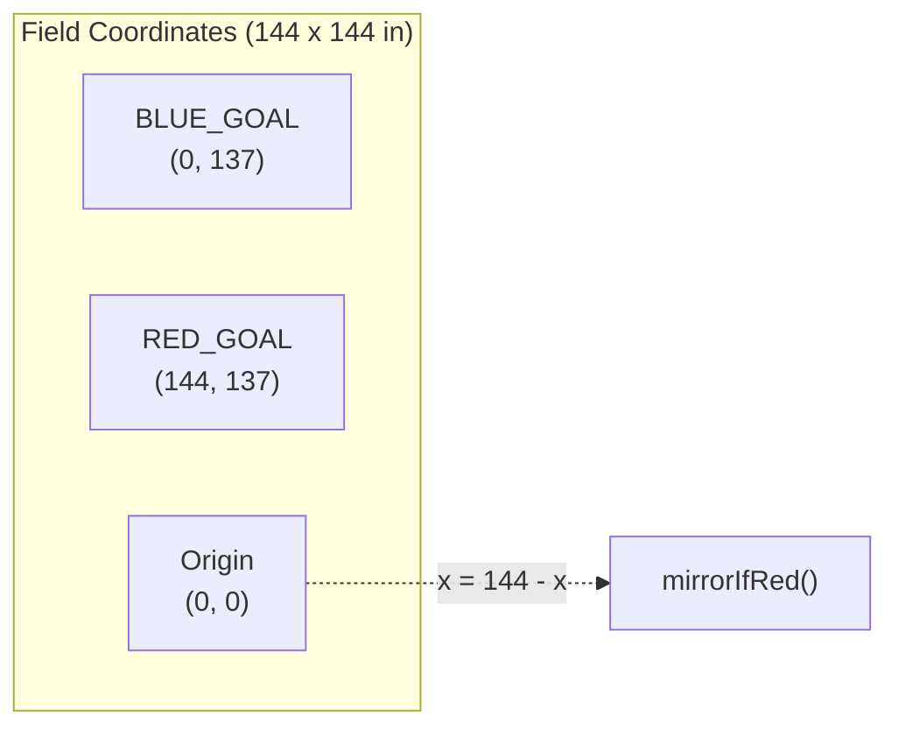

Blue and red field positions are mirrored across the x-axis midline (`x = 72`). All autonomous routines are authored in blue coordinates and mirrored at runtime via `BotUtilsNew.mirrorIfRed()`.

---

## Action System

Actions are composable units of autonomous behavior. They follow a strategy/decorator pattern where wrappers add timeout, conditional, and sequencing behavior.

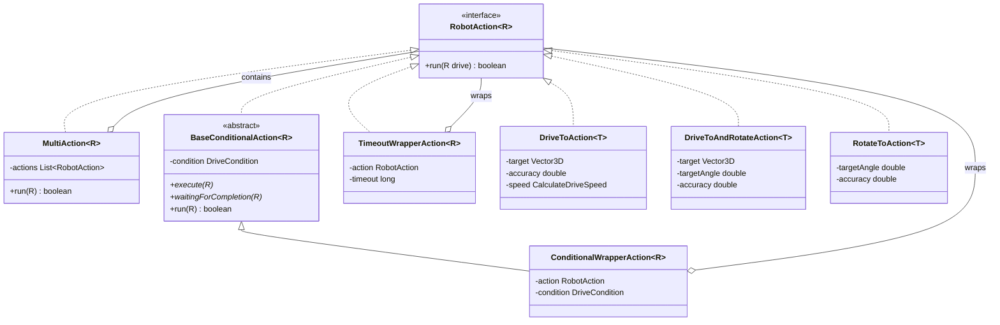

### Action Composition Example

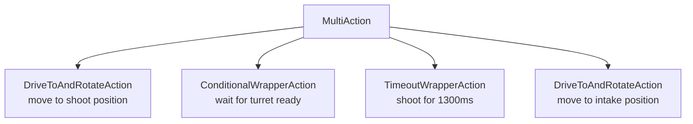

---

## Launcher Subsystem

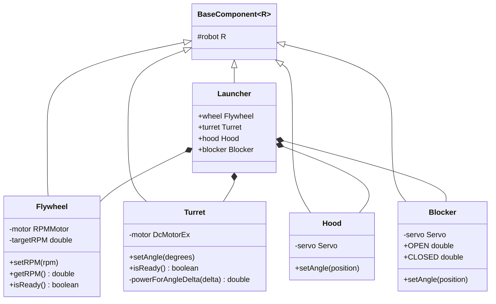

### Turret Power Curve

The turret uses linear interpolation to scale motor power based on how far it needs to rotate, preventing timing belt slip on large movements.

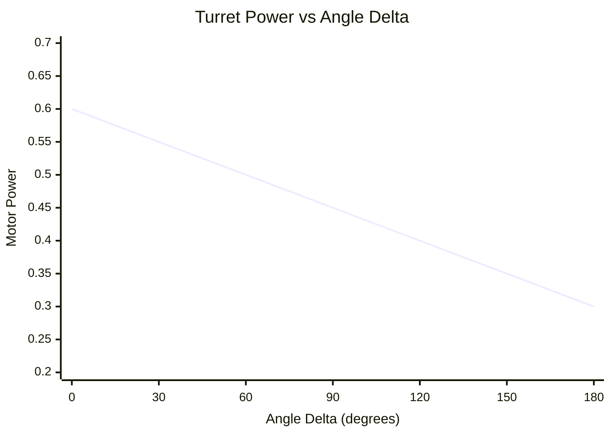

### Auto-Aim Flow

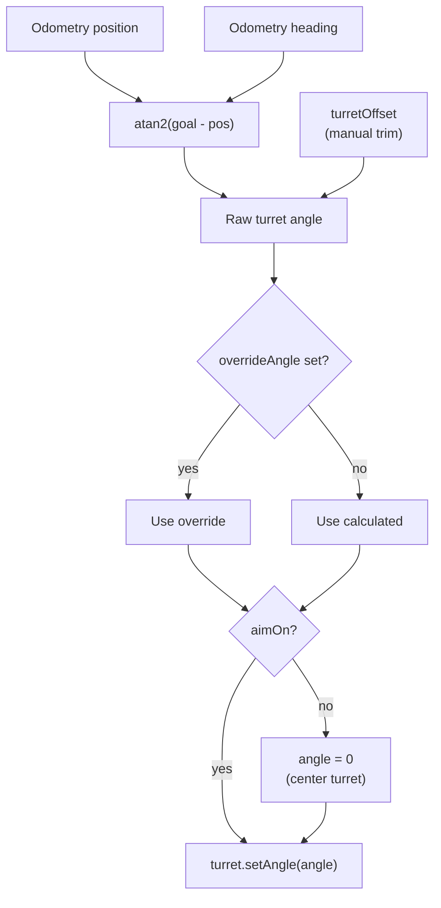

---

## Intake Subsystem

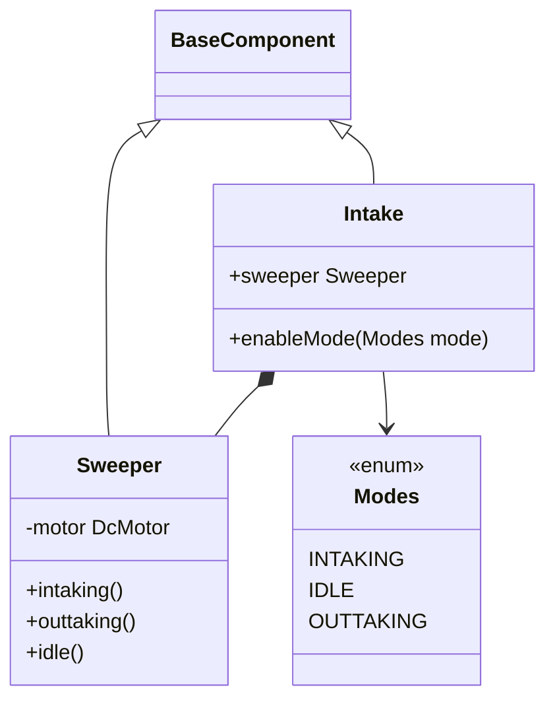

---

## Opmode Lifecycle

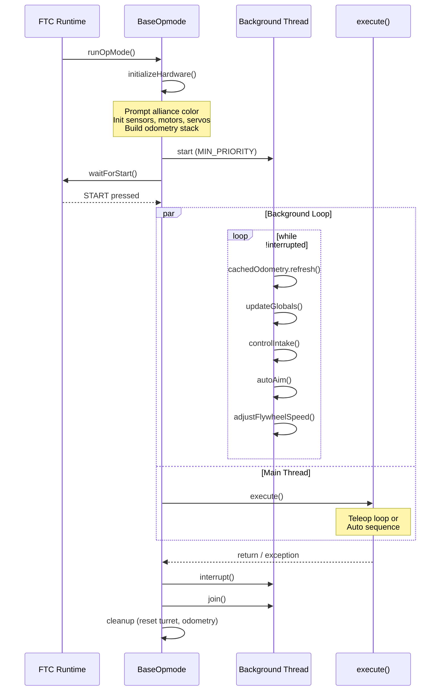

---

## Autonomous Sequence System

Autonomous routines are configured declaratively using `AutoSequenceConfig` and the `AutoStep` enum, then executed by `runAutoSequence()`.

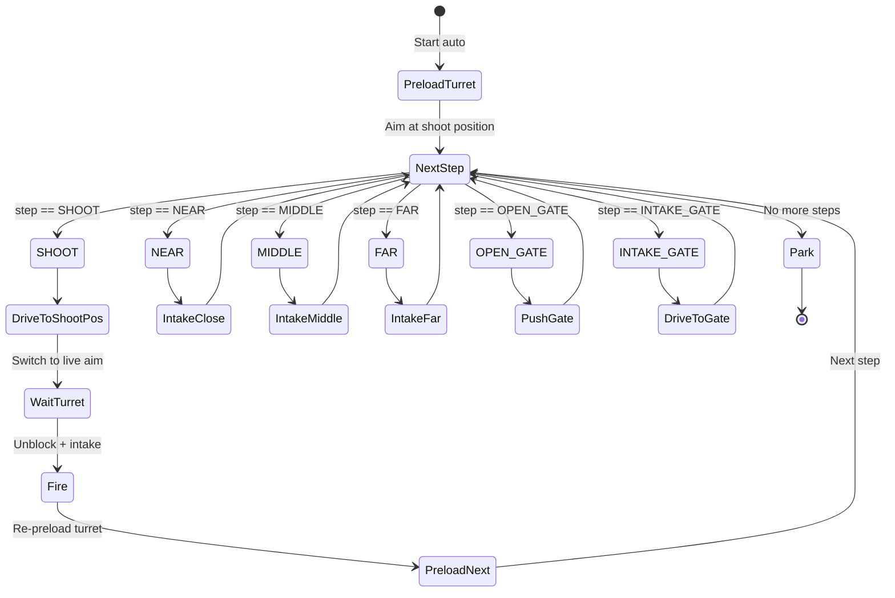

### Example: AutoClose15 Sequence

---

## Flywheel Speed Control

The flywheel RPM is calculated as an exponential function of distance to goal, allowing harder shots from farther away. The hood angle adjusts in discrete bands to change the launch trajectory.

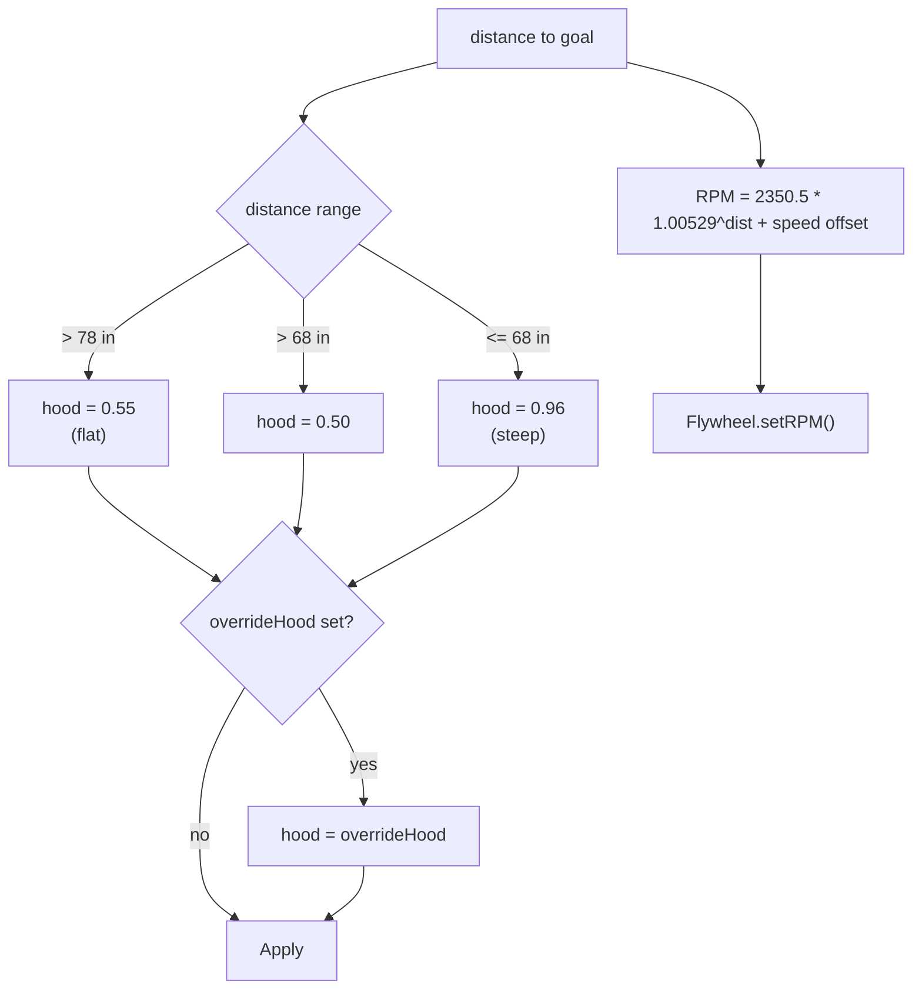

---

## Hardware Map

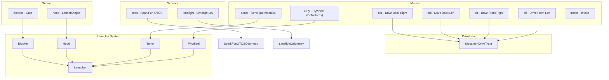

---

## Key Design Patterns

| Pattern | Where | Purpose |
|---|---|---|
| **Adapter** | HolonomicPositionDriveAdapter | Converts field-relative to robot-relative |
| **Decorator** | TimeoutWrapperAction, ConditionalWrapperAction | Adds behavior to actions |
| **Composite** | MultiAction | Sequences actions |
| **Strategy** | CalculateDriveSpeed, CalculateRotationSpeed | Pluggable velocity profiles |
| **Template Method** | BaseOpmode.runOpMode → execute() | Consistent init with custom logic |
| **Sensor Fusion** | GroundingOdometry | Blends absolute + relative sensors |
| **Caching** | CachedOdometry, Cache\<T\> | Reduces sensor polling overhead |
| **Factory** | BotUtilsNew | Convenient action construction |
| **Component** | BaseComponent\<R\> | Uniform subsystem structure |
